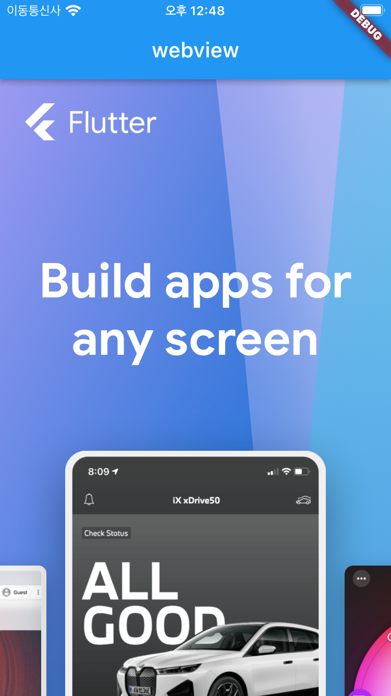
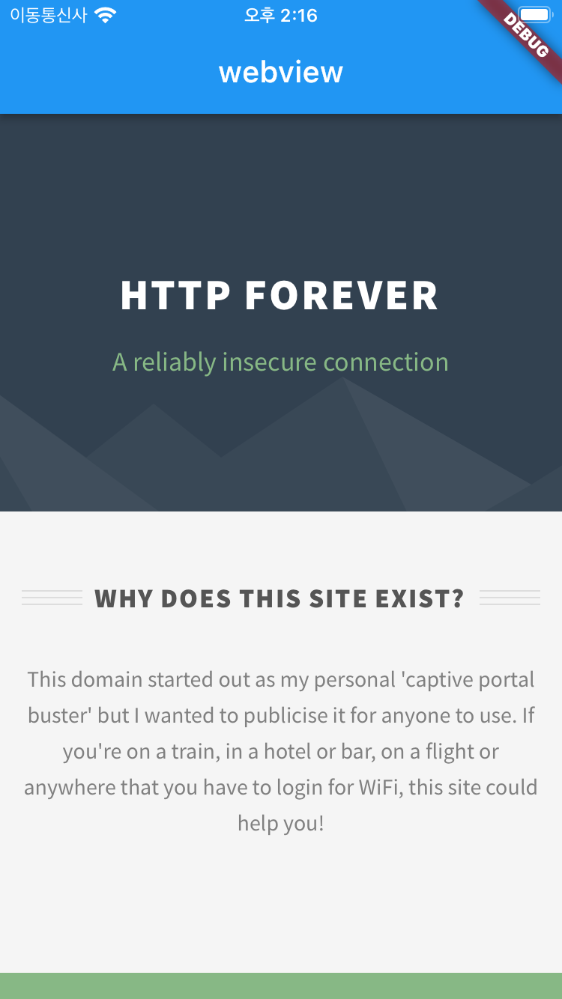

# flutter's webview DIVE

## 0. intro

말이 많은 플러터의 웹 뷰지만 결국은 써야할 일이 있을 것이다.

## 1. webview 바로 쓰기
플러터에서 html을 표시하려면 웹 뷰를 사용해야 한다.
웹 뷰는 기본 SDK 에 포함되어 있지 않으므로 따로 플러그인을 설치해야 한다.

플러터의 공식 웹 뷰 플러그인은 [webview_flutter](https://pub.dev/packages/webview_flutter) 다. **pubspec.yaml** 파일에 저장하거나, pub 명령어를 이용해서

```shell
flutter pub add webview_flutter
```
로 설치하면 된다.

그 외에 기능이 더 강화된 [flutter_inappwebview](https://pub.dev/packages/flutter_inappwebview) 도 있는데 여기서는 webview_flutter 에 대해서만 설명한다.

webview_flutter는 Android와 IOS에서만 사용 가능하다.

### 1-1. WebView 위젯

[WebView](https://pub.dev/documentation/webview_flutter/latest/webview_flutter/WebView-class.html) 위젯을 사용해보자.

```dart
body: const WebView(),
```

아무 페이지도 불러오지 않았기 때문에 아무 것도 안 보여야 정상이다.

[]()


### 1-2. initialUrl

처음에 페이지를 불러오려면 initialUrl을 써야한다.
initialUrl 을 바꾸고 나면, hot reload 가 아닌 hot restart 를 해야 한다.
initialUrl은 위젯이 초기화 될 때 한 번만 url을 불러오는 속성이기 때문이다.

```dart
body: const WebView(
    initialUrl: 'https://flutter.dev',
),
```

[]()

### 1-3. javascriptMode

웹 뷰에서는 기본적으로 자바스크립트를 사용할 수 없도록 되어 있다.
대부분의 웹 페이지에서 js를 사용하니 javascriptMode 속성을 바꿔서
우리의 웹 뷰에서 자바스크립트를 실행하게 해주자.

```dart
body: const WebView(
    initialUrl: 'https://google.com',
    javascriptMode: JavascriptMode.unrestricted,
),
```

## 2. [webview 제대로 설치](markdowns/2.md)


webview_flutter의 제약 조건을 확인하고, 제대로 설치해보자.

### 2-1. http only

현대적인 웹 페이지는 대부분 https 를 사용하고 있어서 거의 문제되지 않지만, 지금 우리 웹 뷰는 **http만 지원하는 웹 페이지**는
출력하지 못한다.

```dart
body: const WebView(
    initialUrl: 'http://httpforever.com/',
    javascriptMode: JavascriptMode.unrestricted,
),
```

http만 지원하는 웹 페이지를 출력하려고 하면,

[]()

이렇게 하얀 화면 또는 에러 페이지가 나올 것이다.
이건 웹 뷰의 문제가 아니고 네이티브 플랫폼에서 해결해야 하는 문제다.

수정해야 하는 파일은 아래와 같다.

Android : 
[android/app/src/main/AndroidManifest.xml](android/app/src/main/AndroidManifest.xml)

IOS :
[ios/Runner/Info.plist](ios/Runner/Info.plist)

- Android 의 경우

```xml
   <application
        android:label="flutter_webview_dive"
        android:name="${applicationName}"
        android:icon="@mipmap/ic_launcher"
        android:useCleartextTraffic="true"  <!-- 여기 줄 추가 -->
        >
        <activity
            android:name=".MainActivity"
            android:exported="true"
            android:launchMode="singleTop"
            android:theme="@style/LaunchTheme"

    ...
```

- ios 의 경우

```plist 
    ...

    <!-- 여기 가운데 코드 추가 -->
    <key>NSAppTransportSecurity</key>
    <dict>
        <key>NSAllowsArbitraryLoads</key> 
        <true/>
    </dict>
    <!-- 여기 가운데 코드 추가 -->
</dict>
</plist>

```

플러터에서 이런 네이티브 파일을 수정하고 나면 다시 빌드 해야 한다.

다시 빌드를 하면 페이지가 보이는 것을 확인할 수 있다.

[]()

### 2-2. 지원하는 OS 버전

[]()

Android SDK 20+, IOS 9.0+ 버전을 지원한다.