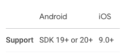

# [**<**](../README.md)

## 2. flutter_webview 제대로 설치하기

webview_flutter의 제약 조건을 확인하고, 제대로 설치해보자.

이전 페이지에서 pubspec 에 추가하는 것은 했으니 제외한다.

### 2-1. http only

현대적인 웹 페이지는 대부분 https 를 사용하고 있어서 거의 문제되지 않지만, 지금 우리 웹 뷰는 **http만 지원하는 웹 페이지**는
출력하지 못한다.

```dart
body: const WebView(
    initialUrl: 'http://httpforever.com/',
    javascriptMode: JavascriptMode.unrestricted,
),
```

http만 지원하는 웹 페이지를 출력하려고 하면,

[]()

이렇게 하얀 화면 또는 에러 페이지가 나올 것이다.
이건 웹 뷰의 문제가 아니고 네이티브 플랫폼에서 해결해야 하는 문제다.

수정해야 하는 파일은 아래와 같다.

Android : 
[android/app/src/main/AndroidManifest.xml](android/app/src/main/AndroidManifest.xml)

IOS :
[ios/Runner/Info.plist](ios/Runner/Info.plist)

- Android 의 경우

```xml
   <application
        android:label="flutter_webview_dive"
        android:name="${applicationName}"
        android:icon="@mipmap/ic_launcher"
        android:useCleartextTraffic="true"  <!-- 여기 줄 추가 -->
        >
        <activity
            android:name=".MainActivity"
            android:exported="true"
            android:launchMode="singleTop"
            android:theme="@style/LaunchTheme"

    ...
```

- ios 의 경우

```plist 
<plist>
<dict>
    ...

    <!-- 여기 가운데 코드 추가 -->
    <key>NSAppTransportSecurity</key>
    <dict>
        <key>NSAllowsArbitraryLoads</key> 
        <true/>
    </dict>
    <!-- 여기 가운데 코드 추가 -->
</dict>
</plist>

```

플러터에서 이런 네이티브 파일을 수정하고 나면 다시 빌드 해야 한다.

다시 빌드를 하면 페이지가 보이는 것을 확인할 수 있다.

[]()

### 2-2. 지원하는 OS 버전

[]()

Android SDK 20+, IOS 9.0+ 버전을 지원한다.

- android

    [android/app/build.gradle](../android/app/build.gradle)

```gradle
    defaultConfig {
        // TODO: Specify your own unique Application ID (https://developer.android.com/studio/build/application-id.html).
        applicationId "com.example.flutter_webview_dive"
        // minSdkVersion flutter.minSdkVersion
        minSdkVersion 20 // 또는 그 이상
        targetSdkVersion flutter.targetSdkVersion
        versionCode flutterVersionCode.toInteger()
        versionName flutterVersionName
    }
```

- ios

    기본 버전이 9.0 이므로 괜찮다.

