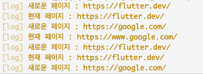

# [**<**](../README.md)

## 3++. 현재 Url 확인하기

[doc](https://pub.dev/documentation/webview_flutter/latest/webview_flutter/WebViewController/currentUrl.html)

```dart
controller.currentUrl()
```

아주 간단한 메소드.
initialUrl을 지정하지 않았다면 null 을 리턴한다.

Future 를 리턴하는 비동기 메소드라는 점을 조심하면 문제 될 것은 없다.

```dart
class _HomePageState extends State<HomePage> {
  late WebViewController wvController;

  int index = 0;

  List<String> urls = ['https://flutter.dev/', 'https://google.com/'];

  @override
  Widget build(BuildContext context) {
    return Scaffold(
      appBar: AppBar(
        title: const Text('webview'),
      ),
      body: WebView(
        initialUrl: urls[index],
        javascriptMode: JavascriptMode.unrestricted,
        onWebViewCreated: (wvController) {
          this.wvController = wvController;
        },
        onPageStarted: (String page) {
          log('새로운 페이지 : $page');
        },
      ),
      floatingActionButton: FloatingActionButton(
        onPressed: () async {
          final whereAmI = await wvController.currentUrl();

          log('현재 페이지 : $whereAmI');

          setState(() {
            index = (index + 1) % urls.length;
            wvController.loadUrl(urls[index]);
          });
        },
      ),
    );
  }
}
```

[]()