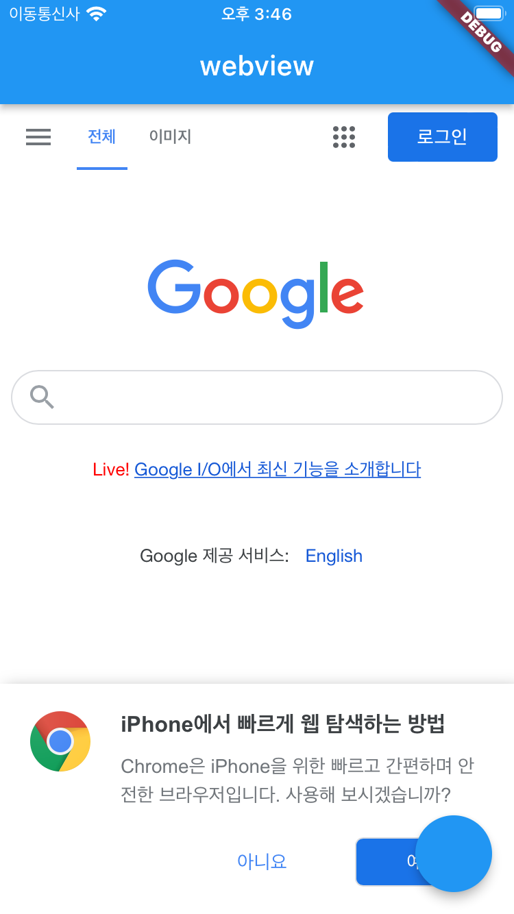

# [**<**](../README.md)

## 3. WebViewController

웹 뷰를 다루는 방법을 알아보자.

initialUrl 말고 동적으로 다른 Url을 불러오고 하면 좋을 것이다. 

### 3-1. onWebViewCreated 콜백
= webview 가 시작할 때 실행되는 콜백

주로 컨트롤러 얻는데 사용한다. 

```dart
body: WebView(
    initialUrl: 'http://httpforever.com/',
    javascriptMode: JavascriptMode.unrestricted,
    onWebViewCreated: (wvController) {},
),
```

### 3-2. WebViewController 얻기

onWebViewCreated 의 wvController 매개 변수를 통해 컨트롤러를 얻을 수 있다.

```dart
class _HomePageState extends State<HomePage> {
  late WebViewController wvController;

  @override
  Widget build(BuildContext context) {
    return Scaffold(
      appBar: AppBar(
        title: const Text('webview'),
      ),
      body: WebView(
        initialUrl: 'https://flutter.dev/',
        javascriptMode: JavascriptMode.unrestricted,
        onWebViewCreated: (wvController) {
          this.wvController = wvController;
        },
      ),
    );
  }
}
```

### 3-3. loadUrl - 새로운 Url 불러오기

```dart
  @override
  Widget build(BuildContext context) {
    return Scaffold(
      appBar: AppBar(
        title: const Text('webview'),
      ),
      body: WebView(
        initialUrl: 'https://flutter.dev/',
        javascriptMode: JavascriptMode.unrestricted,
        onWebViewCreated: (wvController) {
          this.wvController = wvController;
        },
      ),
      floatingActionButton: FloatingActionButton(
        onPressed: () {
          wvController.loadUrl('https://google.com/');
        },
      ),
    );
  }
```

fab 을 누르면 페이지가 바뀌는 걸 확인할 수 있다.

[]()