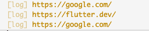
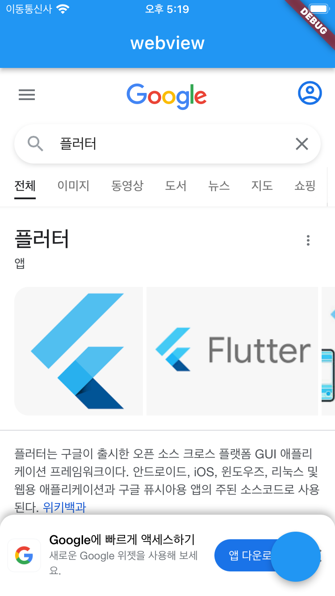
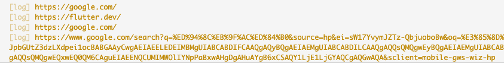

# [**<**](../README.md)

## 4. onPageStarted - 새로운 페이지가 열렸을 때 감지

onWebViewCreated 말고도 유용한 콜백을 알아보자.

여기서 사용할 _HomePageState 코드는 아래와 같다.

```dart
class _HomePageState extends State<HomePage> {
  late WebViewController wvController;

  int index = 0;

  List<String> urls = ['https://flutter.dev/', 'https://google.com/'];

  @override
  Widget build(BuildContext context) {
    return Scaffold(
      appBar: AppBar(
        title: const Text('webview'),
      ),
      body: WebView(
        initialUrl: urls[index],
        javascriptMode: JavascriptMode.unrestricted,
        onWebViewCreated: (wvController) {
          this.wvController = wvController;
        },
      ),
      floatingActionButton: FloatingActionButton(
        onPressed: () {
          setState(() {
            index = (index + 1) % urls.length;
            wvController.loadUrl(urls[index]);
          });
        },
      ),
    );
  }
}
```

FAB 을 누를 때 마다 페이지를 번갈아가며 로드한다.


onPageStarted 를 이용하면 새로운 페이지 로드가 시작되는 것을 감지할 수 있다.

```dart
body: WebView(
    initialUrl: urls[index],
    javascriptMode: JavascriptMode.unrestricted,
    onWebViewCreated: (wvController) {
        this.wvController = wvController;
    },
    onPageStarted: (String page) {
        log(page);
    },
),
```

버튼을 누르면 새로운 페이지 로그가 찍히는 것을 볼 수 있다.



fab 버튼을 이용하지 않고 웹 뷰를 직접 조작해도 똑같은 결과를 얻는다.



