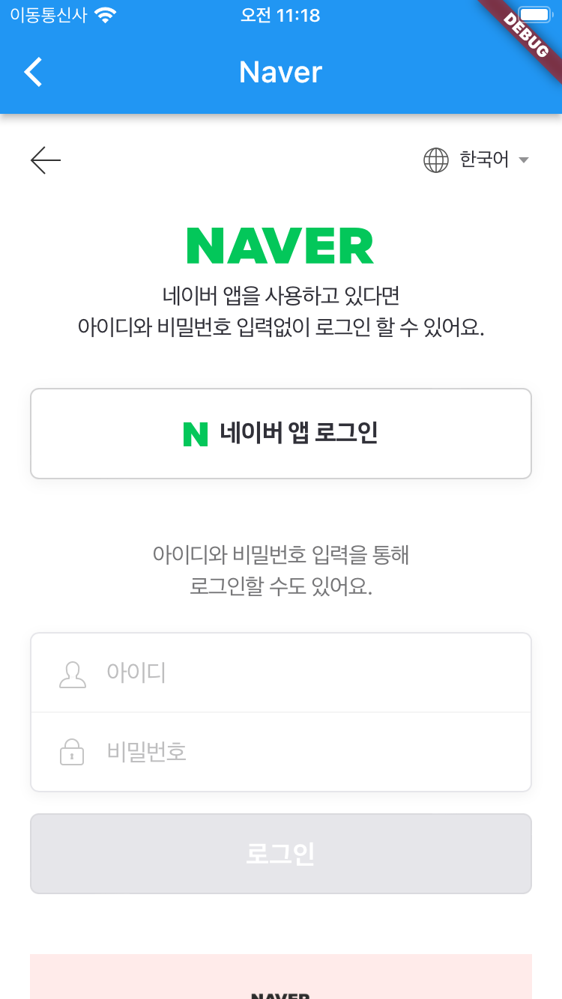
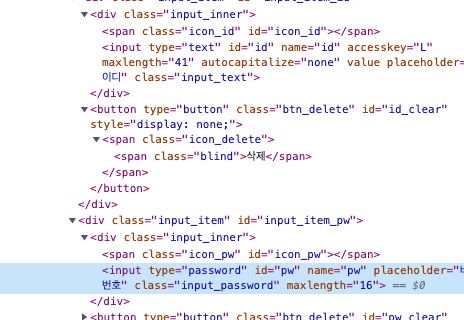
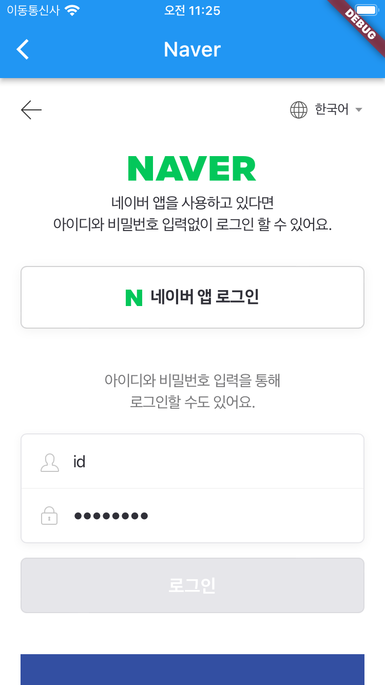
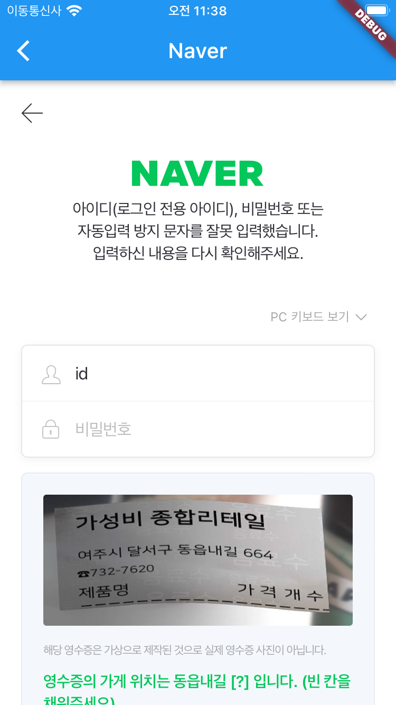

# [**<**](../README.md)

## 5+. naver

네이버 로그인을 해보자.

사용할 코드는 아래와 같다.

```dart
import 'dart:developer';

import 'package:flutter/material.dart';
import 'package:webview_flutter/webview_flutter.dart';

class NaverPage extends StatefulWidget {
  const NaverPage({Key? key}) : super(key: key);

  @override
  State<NaverPage> createState() => _NaverPageState();
}

class _NaverPageState extends State<NaverPage> {
  late WebViewController wvController;

  @override
  Widget build(BuildContext context) {
    return Scaffold(
      appBar: AppBar(
        title: const Text('Naver'),
      ),
      body: WebView(
        initialUrl: 'https://nid.naver.com/',
        javascriptMode: JavascriptMode.unrestricted,
        onWebViewCreated: (wvController) {
          this.wvController = wvController;
        },
        onPageFinished: (page) {
          log('$page is loaded');
        },
      ),
    );
  }
}
```

[]()

지금은 폼에 아무런 입력이 들어 있지 않은데, 페이지가 로드되면 자동으로
폼 필드를 채워 넣어보자.

### 폼 채우기

우선, 브라우저의 개발자 도구로 가서 아이디와 비밀번호의 키를 가져오자.

[]()

onPageFinished 콜백에 폼을 채우는 코드를 넣어보자.

```dart
onPageFinished: (page) {
    log('$page is loaded');

    var userId = "id";
    var userPw = "password";

    wvController
        .runJavascript('document.getElementById("id").value="$userId"');
    wvController
        .runJavascript('document.getElementById("pw").value="$userPw"');
},
```

이제 페이지를 로드하고 나면 폼을 우리가 지정한 값으로 채워준다.

[]()

### 폼 제출

로그인을 시도할 것인데, 당연히 아이디와 비밀번호가 틀릴 것이므로
무한 로그인 루프에 빠지지 않기 위해서 코드를 좀 고쳐주자.

```dart
class _NaverPageState extends State<NaverPage> {
  late WebViewController wvController;

  bool tryLogin = false;

  @override
  Widget build(BuildContext context) {
    return Scaffold(
      appBar: AppBar(
        title: const Text('Naver'),
      ),
      body: WebView(
        initialUrl: 'https://nid.naver.com/',
        javascriptMode: JavascriptMode.unrestricted,
        onWebViewCreated: (wvController) {
          this.wvController = wvController;
        },
        onPageFinished: (page) async {
          log('$page is loaded');

          if (tryLogin) {
            log('로그인에 실패 했습니다.');
          } else {
            setState(() {tryLogin = true;});

            var userId = "id";
            var userPw = "password";

            wvController
                .runJavascript('document.getElementById("id").value="$userId"');
            wvController
                .runJavascript('document.getElementById("pw").value="$userPw"');

            await Future.delayed(const Duration(milliseconds: 500));

            await wvController.runJavascript('document.forms[0].submit()');
          }
        },
      ),
    );
  }
}
```

추가된 부분
- tryLogin 변수를 이용해서 한 번만 로그인 시도하도록 했다.
- 폼이 입력되는 시간을 기다리기 위해서 Future.delayed 를 넣었다.
- form.submit() 하는 코드

당연하게 로그인 실패.
어쨌든 폼을 제출하는데 성공했다.

[]()