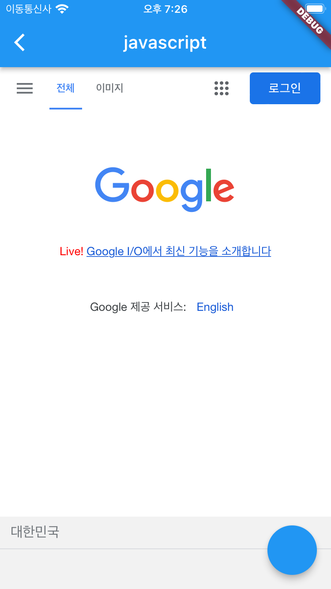

# [**<**](../README.md)

## 5. javascript

### 5-1. runJavascript

WebViewController 의 runJavascript 를 이용하면 javascript 코드를 실행할 수 있다.

아래 코드는 구글 메인 페이지에서 검색 폼을 안 보이게 한다.

```dart
class _JSPageState extends State<JSPage> {
  late WebViewController wvController;

  @override
  Widget build(BuildContext context) {
    return Scaffold(
      appBar: AppBar(title: const Text('javascript')),
      body: WebView(
        initialUrl: 'https://google.com',
        javascriptMode: JavascriptMode.unrestricted,
        onWebViewCreated: (wvController) {
          this.wvController = wvController;
        },
      ),
      floatingActionButton: FloatingActionButton(
        onPressed: () async {
          wvController.runJavascript(
              "document.getElementsByTagName('form')[0].style.display = 'none'");
        },
      ),
    );
  }
}
```

[]()
검색 창이 사라진 구글


### 5-2. runJavaScriptWithResult

javascript 의 결과를 받을 수도 있다.
아래는 웹 뷰에서 1+1 를 수행해서 2를 받아오는 예시다.

```dart
floatingActionButton: FloatingActionButton(
  onPressed: () async {
    Future<String> jsResult =
        wvController.runJavascriptReturningResult("1+1");
    jsResult.then((value) => log(value));
  },
),
```

### 5-3. onPageFinished

>When running JavaScript in a WebView, it is best practice to wait for the WebView.onPageFinished callback. This guarantees all the JavaScript embedded in the main frame HTML has been loaded.

runJavascript, runJavaScriptWithResult 를 쓰기 전에 WebView.onPageFinished 콜백을 기다리는 게 올바르게 사용하는 방법이다.

onPageFinished 는 웹 페이지 로드가 끝나면 호출된다.

아래 코드 처럼 htmlLoading 같은 변수를 사용하면 좋다.

```dart
class _JSPageState extends State<JSPage> {
  late WebViewController wvController;

  bool htmlLoading = false;

  @override
  Widget build(BuildContext context) {
    return Scaffold(
      appBar: AppBar(title: const Text('javascript')),
      body: WebView(
        initialUrl: 'https://google.com',
        javascriptMode: JavascriptMode.unrestricted,
        onWebViewCreated: (wvController) {
          this.wvController = wvController;
        },
        onPageStarted: (page) {
          setState(() {
            htmlLoading = true;
          });
        },
        onPageFinished: (page) {
          log('$page loaded');

          setState(() {
            htmlLoading = false;
          });
        },
      ),
    );
  }
}
```